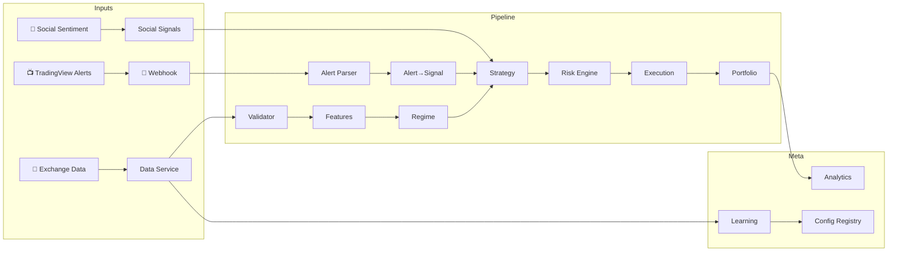

# 🤖 Crypto Bot v4.4

**Multi-exchange algorithmic trading platform** — 13 services, 100+ exchanges via CCXT, TradingView integration with automated alert-to-order execution, social sentiment signals, and offline Walk Forward learning.



---

## 🚀 Quickstart

```bash
git clone <repo> && cd crypto_bot_v4
pip install -r requirements.txt
cp .env.example .env   # add your Binance API keys
python main.py
```

The bot warms up 6 months–5 years of historical data, then begins a 15-second trading cycle. Health API, TradingView webhook, and Prometheus metrics are available at `:8000`.

---

## 📦 What's Inside

### 📺 TradingView → Real Orders

Send any TradingView alert via webhook and the bot converts it into a position with proper risk-sizing, stop-loss, and take-profit — all going through the full Risk → Execution pipeline.

```bash
# TradingView alert → BUY BTCUSDT with SL/TP
curl -X POST :8000/webhook/tradingview \
  -d '{"action":"BUY","symbol":"BTCUSDT","price":65000,"stop_loss":64500,"take_profit":66000}'
```

**Supported alert formats:** JSON, OctoBot-style (`SIGNAL=BUY SYMBOL=BTCUSDT`), plain text, PineConnector. Auto-detected.

**5 indicator adapters** — RSI, MACD, Bollinger Bands, EMA/SMA crossover, Stochastic — each providing adaptive SL/TP and PineScript alert templates you can paste directly into TradingView:

```bash
curl :8000/webhook/indicators/rsi    # PineScript template for RSI alerts
curl :8000/webhook/indicators         # all supported indicators
```

### 💬 Social & Sentiment Signals

Fear & Greed Index, social volume tracking, whale activity, influencer sentiment, and composite scores — used to boost or dampen alert confidence before execution.

```bash
curl :8000/webhook/social?pair=BTCUSDT     # full sentiment profile
curl :8000/webhook/social/fear-greed       # Fear & Greed only
```

Sentiment data feeds into the `AlertToSignalConverter`: extreme fear → higher confidence on buys; extreme greed → tighter stops; whale distributing → reduced position size.

---

## 🏗️ Architecture

### Service Map

```
                   ┌─────────────────────────────────────────┐
                   │              INPUT LAYER                 │
                   │  Binance/Bybit/OKX (CCXT)               │
                   │  TradingView Webhooks + Social APIs     │
                   └───────────────┬─────────────────────────┘
                                   │
   ┌───────────────────────────────┼───────────────────────────────┐
   │                               │                               │
   ▼                               ▼                               ▼
┌──────────┐              ┌──────────────┐              ┌─────────────────┐
│ ① Data   │──────────────▶│ ② Validator  │──────────────▶│  Market DB      │
│ Service  │              │  (6 checks)  │              │  SQLite / PG    │
└──────────┘              └──────┬───────┘              └────────┬────────┘
                                 │                                │
   ┌─────────────────────────────┘                                │
   │                                                              │
   ▼                                                              │
┌──────────┐              ┌──────────────┐                        │
│ ③ Feature│──────────────▶│ ④ Regime     │                       │
│ Service  │              │  Detector    │                       │
│ ADX ATR% │              │  5 modes     │                       │
│ BB CVD   │              │  + ML iface  │                       │
└──────────┘              └──────┬───────┘                       │
                                 │                                │
   ┌─────────────────────────────┘                                │
   │                                                              │
   ▼                                                              │
┌──────────┐   ┌──────────────────┐   ┌──────────────────┐       │
│ ⑤ Strat. │◀──│ TradingView Alerts│◀──│ Social Signals   │       │
│ Engine   │   │ (webhook → Signal)│   │ (Fear/Greed etc) │       │
│ Sweep    │   └──────────────────┘   └──────────────────┘       │
│ Bounce   │                                                      │
│ Breakout │                                                      │
└────┬─────┘                                                      │
     │                                                            │
     ▼                                                            │
┌──────────┐   ┌──────────────┐   ┌──────────────┐               │
│ ⑥ Risk   │──▶│ ⑦ Execution  │──▶│    Exchange   │               │
│ Engine   │   │   Engine     │   │    (CCXT)    │               │
│ Recovery │   │   CircuitBr  │   └──────────────┘               │
│ Limits   │   │   Retry      │                                   │
└────┬─────┘   └──────────────┘                                   │
     │                                                            │
     ▼                                                            │
┌──────────┐                                                      │
│ ⑧ Portf. │  Positions, PnL, Event Sourcing                     │
│ Engine   │◀─────────────────────────────────────────────────────┘
└────┬─────┘
     │
     ▼
┌──────────┐  ┌──────────────┐  ┌──────────────┐  ┌──────────────┐
│ ⑨ Anal.  │  │ ⑩ Learning   │  │ ⑪ Config     │  │ ⑫ Health     │
│ Service  │  │   Service    │  │   Registry   │  │   Monitor    │
│ Sharpe   │  │ Walk Forward │  │  Versioned   │  │   8 metrics  │
│ Calmar   │  │ Bayesian     │  │  Immutable   │  │   auto-stop  │
│ PF MAE   │  │ EWMA Score   │  │  Hashed      │  │              │
└──────────┘  └──────────────┘  └──────────────┘  └──────────────┘

                           ┌──────────────────┐
                           │ ⑬ TradingView     │
                           │   Service         │
                           │ Alert → Signal    │
                           │ Indicators        │
                           │ Social/Sentiment  │
                           └──────────────────┘
```

### Online vs Offline

| Mode | Actions | Must Not |
|------|---------|----------|
| **Online** | Collect stats, Bayesian update, EWMA, execute trades | ❌ Change parameters |
| **Offline** | Walk Forward, multi-criteria scoring, release candidate config | — |

---

## 📊 Trading Strategies

### ① Liquidity Sweep
Price breaks a liquidity level, wicks through, recovers — classic stop-hunt entry.
```
Wick ratio 1.8–2.5 · Volume ×1.25 · Min RR 2.0
```

### ② Liquidity Bounce
Price touches a level without breaking, bounces off — range-bound trading.
```
Wick ratio 1.5–2.0 · Volume ×1.10 · Min RR 1.5
```

### ③ Volatility Breakout
Squeeze (BB inside Keltner) resolves with volume expansion — momentum entry.
```
Squeeze active + Volume ×1.25 · SL ×1.5 ATR · TP 2–4%
```

### Confidence Calibration
```
CONFIDENCE = trend_match×0.25 + volume_spike×0.20
           + structure_quality×0.15 + liquidity_depth×0.20
           + session_score×0.20
```
Target: `confidence=80%` → actual winrate ≈ `80%`.

---

## 🎛️ Market Regimes

| Regime | ADX | ATR% | Bounce | Sweep | Breakout |
|--------|-----|------|--------|-------|----------|
| 🔴 Trend High Vol | > 25 | > 80 | 0.2 | **0.6** | 0.2 |
| 🟠 Trend Low Vol | > 25 | < 20 | 0.3 | **0.5** | 0.2 |
| 🟡 Range High Vol | < 25 | > 80 | **0.5** | 0.3 | 0.2 |
| 🟢 Range Low Vol | < 25 | < 20 | **0.6** | 0.3 | 0.1 |
| 🔵 Breakout | — | — | 0.1 | 0.2 | **0.7** |

**Smooth blending:** `final_weight = 0.5 × matrix + 0.5 × sigmoid_gaussian`
```
bounce_weight   = sigmoid((20 − adx) / 5)
sweep_weight    = gaussian(adx, μ=30, σ=10)
breakout_weight = sigmoid((adx − 40) / 5)
```
ML-ready: `RegimeDetector.predict(features: dict) → str` — swap in a trained model later.

---

## 🛡️ Risk Management

| Layer | Mechanism |
|-------|-----------|
| **Position** | 1.5% risk/trade · adaptive SL (×0.8 … ×1.5) · adaptive RR (1.5–5.0) |
| **Limits** | Max 3 positions · correlation ≤ 0.7 · exposure ±3.0% |
| **Recovery** | Drawdown > 8% → risk halved, learning frozen → exit at < 5% + 3 consecutive wins |
| **Drawdown** | Daily 2% · Weekly 5% · Monthly 10% · Total 15% |

---

## 🧠 Learning

**Walk Forward:** Train 6mo → Test 1mo → Step 1mo. Min 3 stable windows.

**Multi-Criteria Score:** `0.35×sharpe + 0.25×pf + 0.20×dd + 0.20×stability`

**Bayesian (online):** Beta(α, β) updated per trade → expected winrate + 95% credible interval

**EWMA (online):** `EWMA_return = 0.05×rr + 0.95×EWMA_return` → early degradation detection

---

## 📁 Project Structure

```
crypto_bot_v4/
├── main.py                               # Orchestrator: 15-sec main loop
├── requirements.txt / pyproject.toml     # Dependencies + pytest config
├── .env.example                          # Environment template
├── LICENSE                               # MIT
│
├── config/
│   ├── config_v4.4.1.yaml                # Full system config (YAML)
│   └── registry.py                       # Versioned, immutable config store
│
├── core/
│   ├── models/__init__.py                # 20+ dataclasses
│   ├── database/db_manager.py            # SQLAlchemy ORM (7 tables, bulk upsert)
│   ├── events/event_store.py             # Event Sourcing for Portfolio
│   └── exchange/adapter.py               # CCXT unified exchange interface
│
├── services/
│   ├── data_service/service.py           # OHLCV + OI + funding (CCXT, parallel warmup)
│   ├── data_validator/validator.py       # 6 data quality checks
│   ├── feature_service/calculator.py     # ADX, ATR%, BB, CVD, levels (vectorized)
│   ├── regime_detector/detector.py       # 5 regimes + sigmoid/gaussian + ML iface
│   ├── strategy_engine/engine.py         # Sweep / Bounce / Breakout
│   ├── risk_engine/engine.py             # Position sizing + Recovery Mode
│   ├── execution_engine/engine.py        # Orders + Circuit Breaker + retry
│   ├── portfolio_engine/engine.py        # Positions + Event Sourcing
│   ├── analytics_service/service.py      # Sharpe, Calmar, PF, MAE/MFE
│   ├── learning_service/service.py       # Walk Forward + Bayesian + EWMA
│   ├── health_monitor/monitor.py         # 8 engineering metrics
│   └── tradingview_service/              # 📺 NEW: TradingView integration
│       ├── __init__.py                   #   AlertParser, Converter, Security, Manager
│       ├── indicators/registry.py        #   RSI, MACD, BB, EMA/SMA, Stoch, VolProf
│       └── social/registry.py            #   Fear & Greed, sentiment, whale activity
│
├── api/
│   ├── server.py                         # FastAPI + Prometheus metrics
│   └── tradingview_routes.py             # Webhook endpoints + indicator/social API
│
├── tests/
│   ├── unit/test_services.py             # 45 tests: core services
│   ├── unit/test_exchange.py             # 16 tests: CCXT adapter
│   └── unit/test_tradingview.py          # 49 tests: TV integration
│
├── docker/
│   ├── Dockerfile / docker-compose.yml   # 5-container stack
│   └── prometheus.yml
│
└── docs/
    ├── ARCHITECTURE.md / API.md / CONFIG.md
    ├── DEPLOYMENT.md / BACKTEST.md
    ├── EXPERIMENTS.md / TROUBLESHOOTING.md
```

---

## 📺 TradingView Integration

### Endpoints

| Method | URL | Purpose |
|--------|-----|---------|
| `POST` | `/webhook/tradingview` | Main webhook — accepts JSON, OctoBot, plain text, PineConnector |
| `POST` | `/webhook/tradingview/v2` | Extended webhook with indicator data payload |
| `GET` | `/webhook/indicators` | List all supported indicators + PineScript templates |
| `GET` | `/webhook/indicators/{name}` | Get PineScript alert template for a specific indicator |
| `GET` | `/webhook/social?pair=BTCUSDT` | Social/sentiment signals for a pair |
| `GET` | `/webhook/social/fear-greed` | Fear & Greed Index only |
| `GET` | `/webhook/alerts/recent` | Recent alert history |

### Alert → Trade Flow

```
TradingView Alert
    │
    ▼
AlertParser.detect_format()   ← auto-detect JSON / OctoBot / plain / PineConnector
    │
    ▼
WebhookSecurity.validate()    ← token / HMAC
    │
    ▼
AlertManager.should_process() ← dedup (30s window) + rate limit (20/min)
    │
    ▼
IndicatorRegistry.recommend() ← adaptive SL/TP from RSI/MACD/BB values
SocialSignalRegistry.get()    ← sentiment boost/cut on confidence
    │
    ▼
AlertToSignalConverter        ← ParsedAlert → native Signal
    │
    ▼
RiskEngine.evaluate_signal()  ← position sizing, limits, recovery check
    │
    ▼
ExecutionEngine.place_entry() ← CCXT order → exchange
    │
    ▼
PortfolioEngine.open_position()
```

### PineScript Templates (paste into TradingView)

```pinescript
// RSI alert — paste this into TradingView alert message box:
rsiValue = ta.rsi(close, 14)
// Alert: rsiValue < 30 (oversold → BUY)
// Alert: rsiValue > 70 (overbought → SELL)
// Webhook URL: https://your-server:8000/webhook/tradingview/v2
// Message: {"action":"{{strategy.order.action}}","symbol":"BTCUSDT","indicator":"rsi","indicator_value":{{plot("RSI")}},"confidence":0.8}
```

---

## 💚 API Endpoints

| Method | URL | Purpose |
|--------|-----|---------|
| `GET` | `/health` | Health check |
| `GET` | `/health/status` | Detailed health + 24h uptime |
| `GET` | `/portfolio` | Balance, equity, positions, PnL |
| `GET` | `/analytics/metrics` | Winrate, Sharpe, Calmar, PF |
| `GET` | `/analytics/daily` | Daily report |
| `GET` | `/learning/status` | Bayesian winrates, EWMA return |
| `GET` | `/config/current` | Active config |
| `GET` | `/config/versions` | Config version history |
| `GET` | `/execution/quality` | Slippage, latency, fill rate |
| `GET` | `/metrics` | Prometheus metrics |

---

## 🐳 Deployment

```bash
docker-compose -f docker/docker-compose.yml up -d
```

Stack: **Bot** + **PostgreSQL 15** + **Redis 7** + **Prometheus** + **Grafana**

| URL | Service |
|-----|---------|
| `:3000` | Grafana (admin/admin) |
| `:9090` | Prometheus |
| `:8000` | Bot API + TradingView webhook |
| `:8000/docs` | Swagger UI |

---

## 🔌 CCXT: Any Exchange, Same API

```python
from core.exchange.adapter import create_exchange

ex = create_exchange("binance", api_key="...", api_secret="...", testnet=True)
ex = create_exchange("bybit",   api_key="...", api_secret="...", testnet=True)
ex = create_exchange("okx",    api_key="...", api_secret="...")
```

Switch exchanges with one env var:

```bash
EXCHANGE_ID=bybit python main.py
```

Built-in: Circuit Breaker, Rate Limiter, symbol normalization (`BTCUSDT` ↔ `BTC/USDT`), retry with exponential backoff.

---

## 🧪 Tests

```bash
python -m pytest tests/ -v                     # 94 tests
python -m pytest tests/ -v --cov=services --cov=core
```

| Group | Tests | Covers |
|-------|-------|--------|
| **TradingView** | 49 | Alert parsing (4 formats), indicator adapters, social signals, security, dedup, converter |
| **Exchange** | 16 | Circuit Breaker, symbol normalization, factory, Rate Limiter |
| **Core Services** | 29 | Validator, Features, Regime, Strategy, Risk, Bayesian, EWMA, Analytics |

**94/94 pass ✅ · 0 warnings**

---

## 🛠️ Stack

| Layer | Technology |
|-------|-----------|
| Language | Python 3.10+ |
| Exchange API | CCXT 4.4+ (Binance / Bybit / OKX / Kraken / 100+) |
| Webhook server | FastAPI + Uvicorn |
| Database | SQLite (dev) → PostgreSQL 15 (prod) |
| Cache | Redis 7 |
| Monitoring | Prometheus + Grafana |
| Logging | structlog |
| Data | Parquet (history) |
| Tests | pytest + pytest-asyncio |

---

## 📚 Docs

| Document | Content |
|----------|---------|
| [ARCHITECTURE.md](docs/ARCHITECTURE.md) | Service interactions, data flow, Online/Offline |
| [API.md](docs/API.md) | All API endpoints |
| [CONFIG.md](docs/CONFIG.md) | Every config parameter |
| [DEPLOYMENT.md](docs/DEPLOYMENT.md) | Docker, env vars, infrastructure |
| [BACKTEST.md](docs/BACKTEST.md) | Walk Forward methodology |
| [EXPERIMENTS.md](docs/EXPERIMENTS.md) | Experiment log, versioning |
| [TROUBLESHOOTING.md](docs/TROUBLESHOOTING.md) | Common issues and fixes |

---

## ✅ Completion Checklist

| Criterion | Status |
|-----------|--------|
| 13 core services + TV integration | ✅ |
| CCXT adapter (100+ exchanges) | ✅ |
| TradingView webhook → real orders | ✅ |
| 5 indicator adapters + PineScript templates | ✅ |
| Social/sentiment signals (Fear & Greed, whales, volume) | ✅ |
| FastAPI + Prometheus metrics | ✅ |
| Online/Offline separation | ✅ |
| Walk Forward + Bayesian + EWMA | ✅ |
| Recovery Mode + Circuit Breaker | ✅ |
| Data Validator (6 checks) | ✅ |
| Health Monitor (8 metrics) | ✅ |
| Event Sourcing (Portfolio) | ✅ |
| Config Registry (versioned, immutable, hashed) | ✅ |
| Docker Compose (5 containers) | ✅ |
| 94 tests, 0 warnings | ✅ |
| 7 docs | ✅ |
| Profitability: PF > 1.3 | 🔜 Forward-test |
| Stability on 2+ regimes | 🔜 Forward-test |

---

<p align="center">
  <b>Crypto Bot v4.4</b><br>
  Version 4.4.1 · 13.07.2026 · 94 tests · 100+ exchanges · TradingView ready<br>
  <sub>Built on CCXT · Python · Docker · Prometheus/Grafana</sub>
</p>
