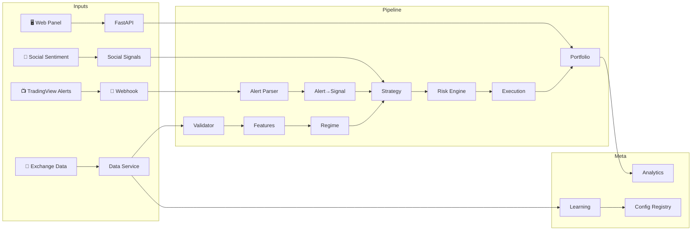
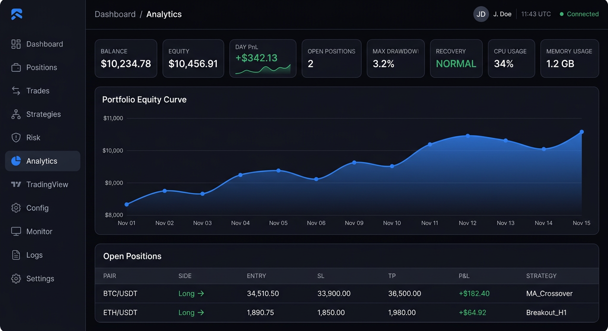
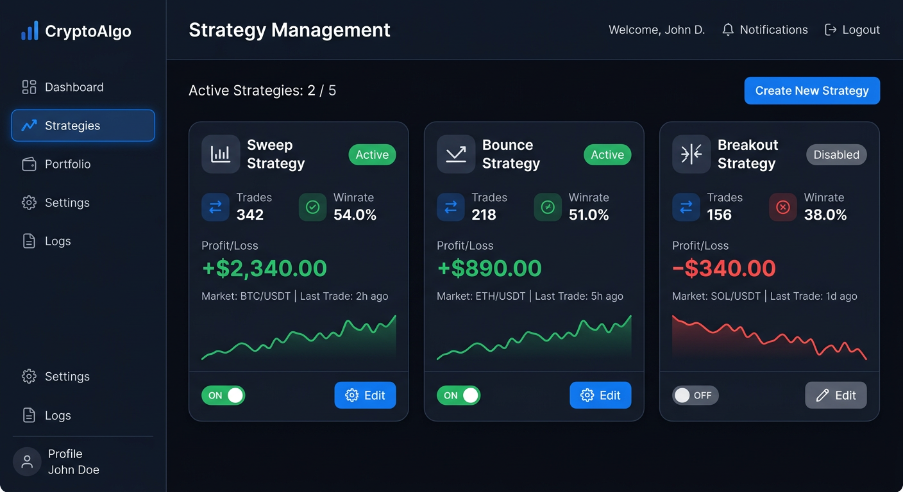
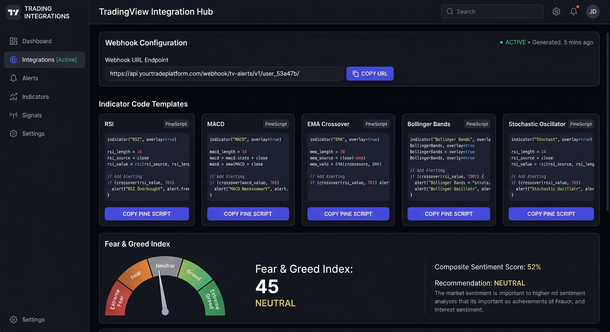

# 🤖 Crypto Bot v5.0

**Multi-exchange algorithmic trading platform** — 13+1 services, 100+ exchanges via CCXT, TradingView webhook integration, social sentiment signals, offline Walk Forward learning, **and a React web dashboard** with 11 pages of real-time monitoring and control.



---

## 🖥️ Web Panel

Built-in React dashboard served directly from the bot's FastAPI server — no separate deployment needed.

<p align="center">
  
  <br><em>Dashboard — real-time metrics, equity curve, open positions</em>
</p>

<p align="center">
  
  <br><em>Strategies — Sweep/Bounce/Breakout cards with metrics & controls</em>
</p>

<p align="center">
  
  <br><em>TradingView — webhook URL, PineScript templates, Fear & Greed</em>
</p>

| Page | Route | What it shows |
|------|-------|---------------|
| **Dashboard** | `/` | 8 metric cards, equity chart, positions, health status |
| **Positions** | `/positions` | Full table with close actions, P&L coloring |
| **Trades** | `/trades` | History with filters, summary bar, profit factor |
| **Strategies** | `/strategies` | 3 strategy cards with params, enable/disable, metrics |
| **Risk** | `/risk` | Drawdown progress bars, stop multipliers, Recovery Mode |
| **Analytics** | `/analytics` | KPIs, strategy breakdown table, PnL chart |
| **TradingView** | `/tradingview` | Webhook URL, 5 PineScript templates, social signals |
| **Config** | `/config` | YAML editor, environment tabs, version history |
| **Monitor** | `/monitor` | 8 system metrics, uptime 24h/7d/30d |
| **Logs** | `/logs` | Real-time stream, 5 level filters, search, pause |
| **Settings** | `/settings` | Bot start/stop, exchange config, notifications |

### Running the panel

```bash
cd web && npm install && npm run build   # production build
cd .. && python main.py                   # serves API + panel at :8000
```

For development with hot-reload: `cd web && npm run dev` (Vite dev server on `:5173` proxies API to `:8000`).

---

## 🚀 Quickstart

```bash
git clone <repo> && cd crypto_bot_v4
pip install -r requirements.txt
cp .env.example .env   # add your Binance API keys

# Web panel (optional — for the dashboard)
cd web && npm install && npm run build && cd ..

python main.py
```

Bot warms up history → 15-sec trading cycle begins. Panel at `http://localhost:8000/`. API docs at `:8000/docs`.

---

## 📦 What's Inside

### 📺 TradingView → Real Orders

Send any TradingView alert via webhook and the bot converts it into a position with proper risk-sizing, stop-loss, and take-profit — all going through the full Risk → Execution pipeline.

```bash
curl -X POST :8000/webhook/tradingview \
  -d '{"action":"BUY","symbol":"BTCUSDT","price":65000,"stop_loss":64500,"take_profit":66000}'
```

**Supported alert formats:** JSON, OctoBot-style (`SIGNAL=BUY SYMBOL=BTCUSDT`), plain text, PineConnector. Auto-detected.

**5 indicator adapters** — RSI, MACD, Bollinger Bands, EMA/SMA crossover, Stochastic — each providing adaptive SL/TP and PineScript alert templates:

```bash
curl :8000/webhook/indicators/rsi    # PineScript template for RSI alerts
curl :8000/webhook/indicators         # all supported indicators
```

### 💬 Social & Sentiment Signals

Fear & Greed Index, social volume tracking, whale activity, influencer sentiment, and composite scores — used to boost or dampen alert confidence before execution.

```bash
curl :8000/webhook/social?pair=BTCUSDT     # full sentiment profile
curl :8000/webhook/social/fear-greed       # Fear & Greed only
```

### 🧩 Plugin Architecture

Drop a new `.py` file into `services/strategy_engine/plugins/` and it auto-registers:

```python
from services.strategy_engine.plugins.base import BaseStrategy, SignalResult

class MyStrategy(BaseStrategy):
    name = "my_strategy"
    def detect(self, features, candles, regime) -> Optional[SignalResult]:
        ...
```

3 built-in plugins: `sweep.py`, `bounce.py`, `breakout.py`.

### 📡 Event Bus

Services communicate via `core/events/bus.py` — MemoryBus for dev, RedisStreamBus for production. 15 standard topics (`signal.generated`, `order.filled`, `position.opened`, …).

---

## 🏗️ Architecture

```
                   ┌─────────────────────────────────────────┐
                   │              INPUT LAYER                 │
                   │  Binance/Bybit/OKX (CCXT)               │
                   │  TradingView Webhooks + Social APIs     │
                   │  React Web Panel (SPA)                  │
                   └───────────────┬─────────────────────────┘
                                   │
   ┌───────────────────────────────┼───────────────────────────────┐
   │                               │                               │
   ▼                               ▼                               ▼
┌──────────┐              ┌──────────────┐              ┌─────────────────┐
│ ① Data   │──────────────▶│ ② Validator  │──────────────▶│  Market DB      │
│ Service  │              │  (6 checks)  │              │  SQLite / PG    │
└──────────┘              └──────┬───────┘              └────────┬────────┘
                                 │                                │
   ┌─────────────────────────────┘                                │
   │                                                              │
   ▼                                                              │
┌──────────┐              ┌──────────────┐                        │
│ ③ Feature│──────────────▶│ ④ Regime     │                       │
│ Service  │              │  Detector    │                       │
└──────────┘              └──────┬───────┘                       │
                                 │                                │
   ┌─────────────────────────────┘                                │
   │                                                              │
   ▼                                                              │
┌──────────┐   ┌──────────────────┐   ┌──────────────────┐       │
│ ⑤ Strat. │◀──│ TradingView Alerts│◀──│ Social Signals   │       │
│ Engine   │   └──────────────────┘   └──────────────────┘       │
└────┬─────┘                                                      │
     │                                                            │
     ▼                                                            │
┌──────────┐   ┌──────────────┐   ┌──────────────┐               │
│ ⑥ Risk   │──▶│ ⑦ Execution  │──▶│    Exchange   │               │
│ Engine   │   │   Engine     │   │    (CCXT)    │               │
└────┬─────┘   └──────────────┘   └──────────────┘               │
     │                                                            │
     ▼                                                            │
┌──────────┐                                                      │
│ ⑧ Portf. │  Positions, PnL, Event Sourcing                     │
│ Engine   │◀─────────────────────────────────────────────────────┘
└────┬─────┘
     │
     ▼
┌──────────┐  ┌──────────────┐  ┌──────────────┐  ┌──────────────┐
│ ⑨ Anal.  │  │ ⑩ Learning   │  │ ⑪ Config     │  │ ⑫ Health     │
│ Service  │  │   Service    │  │   Registry   │  │   Monitor    │
└──────────┘  └──────────────┘  └──────────────┘  └──────────────┘

          ┌──────────────────┐  ┌────────────────────┐
          │ ⑬ TradingView    │  │ 🌐 Web Panel (React)│
          │   Service        │  │  SPA served by API  │
          └──────────────────┘  └────────────────────┘
```

---

## 📊 Trading Strategies

### ① Liquidity Sweep
Price breaks a level, wicks through, recovers — classic stop-hunt entry. Wick ratio 1.8–2.5, Volume ×1.25, Min RR 2.0.

### ② Liquidity Bounce
Price touches a level without breaking, bounces off — range-bound trading. Wick ratio 1.5–2.0, Volume ×1.10, Min RR 1.5.

### ③ Volatility Breakout
Squeeze resolves with volume expansion — momentum entry. Squeeze active + Volume ×1.25, SL ×1.5 ATR, TP 2–4%.

### Confidence Calibration
```
CONFIDENCE = trend_match×0.25 + volume_spike×0.20
           + structure_quality×0.15 + liquidity_depth×0.20
           + session_score×0.20
```
Target: `confidence=80%` → actual winrate ≈ `80%`.

---

## 🎛️ Market Regimes

| Regime | ADX | ATR% | Bounce | Sweep | Breakout |
|--------|-----|------|--------|-------|----------|
| 🔴 Trend High Vol | > 25 | > 80 | 0.2 | **0.6** | 0.2 |
| 🟠 Trend Low Vol | > 25 | < 20 | 0.3 | **0.5** | 0.2 |
| 🟡 Range High Vol | < 25 | > 80 | **0.5** | 0.3 | 0.2 |
| 🟢 Range Low Vol | < 25 | < 20 | **0.6** | 0.3 | 0.1 |
| 🔵 Breakout | — | — | 0.1 | 0.2 | **0.7** |

Smooth blending via sigmoid/gaussian. ML-ready interface: `RegimeDetector.predict(features) → str`.

---

## 🛡️ Risk Management

| Layer | Mechanism |
|-------|-----------|
| **Position** | 1.5% risk/trade · adaptive SL (×0.8 … ×1.5) · adaptive RR (1.5–5.0) |
| **Limits** | Max 3 positions · correlation ≤ 0.7 · exposure ±3.0% |
| **Recovery** | Drawdown > 8% → risk halved, learning frozen → exit at < 5% + 3 consecutive wins |
| **Drawdown** | Daily 2% · Weekly 5% · Monthly 10% · Total 15% |

---

## 🧠 Learning

**Walk Forward:** Train 6mo → Test 1mo → Step 1mo. Min 3 stable windows. Multi-criteria score: `0.35×sharpe + 0.25×pf + 0.20×dd + 0.20×stability`.

**Bayesian (online):** Beta(α, β) updated per trade → expected winrate + 95% credible interval.

**EWMA (online):** `EWMA_return = 0.05×rr + 0.95×EWMA_return` → early degradation detection.

---

## 📁 Project Structure

```
crypto_bot_v4/
├── main.py                               # Orchestrator: 15-sec main loop
├── requirements.txt / pyproject.toml     # Dependencies + configs
│
├── config/
│   ├── config_v4.4.1.yaml                # Base config
│   ├── registry.py                       # Versioned config store
│   └── environments/                     # production / paper / backtest YAMLs
│
├── core/
│   ├── models/__init__.py                # 20+ dataclasses
│   ├── database/db_manager.py            # SQLAlchemy ORM + Alembic
│   ├── events/event_store.py + bus.py    # Event Sourcing + EventBus
│   └── exchange/adapter.py               # CCXT (Binance/Bybit/OKX/…)
│
├── services/
│   ├── data_service/                     # OHLCV + WebSocket streams
│   ├── data_validator/                   # 6 data quality checks
│   ├── feature_service/                  # ADX, ATR%, BB, CVD (vectorized)
│   ├── regime_detector/                  # 5 regimes + ML interface
│   ├── strategy_engine/ + plugins/       # Sweep/Bounce/Breakout + plugin system
│   ├── risk_engine/                      # Position sizing + Recovery
│   ├── execution_engine/ + orders/       # Orders + Circuit Breaker
│   ├── portfolio_engine/                 # Positions + Event Sourcing
│   ├── analytics_service/                # Sharpe, Calmar, PF, MAE/MFE
│   ├── learning_service/                 # Walk Forward + Bayesian + EWMA
│   ├── health_monitor/                   # 8 engineering metrics
│   └── tradingview_service/              # Webhook, indicators, social
│
├── api/
│   ├── server.py                         # FastAPI + Prometheus + SPA serving
│   └── tradingview_routes.py             # Webhook endpoints
│
├── web/                                  # 🆕 React SPA dashboard
│   ├── src/pages/                        # 11 pages
│   ├── src/components/                   # Layout, Charts, UI
│   └── src/store/ / hooks/ / api/       # Zustand, WebSocket, TanStack Query
│
├── tests/                                # 94 tests
├── docker/                               # Docker Compose (5 containers)
├── alembic/                              # DB migrations
└── docs/                                 # 8 documentation files
```

---

## 📺 TradingView Integration

### Endpoints

| Method | URL | Purpose |
|--------|-----|---------|
| `POST` | `/webhook/tradingview` | Main webhook — JSON, OctoBot, plain text, PineConnector |
| `POST` | `/webhook/tradingview/v2` | Extended with indicator data payload |
| `GET` | `/webhook/indicators` | List indicators + PineScript templates |
| `GET` | `/webhook/indicators/{name}` | Specific indicator template |
| `GET` | `/webhook/social?pair=BTCUSDT` | Social/sentiment signals |
| `GET` | `/webhook/alerts/recent` | Alert history |

### Alert → Trade Flow

```
TradingView Alert → AlertParser (auto-format) → WebhookSecurity (token/HMAC)
→ AlertManager (dedup + rate-limit) → IndicatorRegistry (adaptive SL/TP)
→ SocialSignalRegistry (sentiment boost) → AlertToSignalConverter (→ Signal)
→ RiskEngine (position sizing) → ExecutionEngine (CCXT order) → PortfolioEngine
```

---

## 💚 API Endpoints

| Method | URL | Purpose |
|--------|-----|---------|
| `GET` | `/health` | Health check |
| `GET` | `/health/status` | Detailed health + 24h uptime |
| `GET` | `/portfolio` | Balance, equity, positions, PnL |
| `GET` | `/analytics/metrics` | Winrate, Sharpe, Calmar, PF |
| `GET` | `/analytics/daily` | Daily report |
| `GET` | `/learning/status` | Bayesian winrates, EWMA return |
| `GET` | `/config/current` | Active config |
| `GET` | `/config/versions` | Config version history |
| `GET` | `/execution/quality` | Slippage, latency, fill rate |
| `GET` | `/metrics` | Prometheus metrics |

---

## 🐳 Deployment

```bash
docker-compose -f docker/docker-compose.yml up -d
```

Stack: **Bot** + **PostgreSQL 15** + **Redis 7** + **Prometheus** + **Grafana**

| URL | Service |
|-----|---------|
| `:3000` | Grafana (admin/admin) |
| `:9090` | Prometheus |
| `:8000` | Bot API + Web Panel + TradingView webhook |
| `:8000/docs` | Swagger UI |

---

## 🔌 CCXT: Any Exchange, Same API

```python
from core.exchange.adapter import create_exchange
ex = create_exchange("binance", api_key="...", api_secret="...", testnet=True)
```

Switch with `EXCHANGE_ID=bybit python main.py`. Built-in: Circuit Breaker, Rate Limiter, retry with exponential backoff.

---

## 🧪 Tests

```bash
python -m pytest tests/ -v                     # 94 tests
python -m pytest tests/ -v --cov=services --cov=core
```

| Group | Tests | Covers |
|-------|-------|--------|
| **TradingView** | 49 | Alert parsing, indicator adapters, social signals, security, dedup, converter |
| **Exchange** | 16 | Circuit Breaker, symbol normalization, factory, Rate Limiter |
| **Core Services** | 29 | Validator, Features, Regime, Strategy, Risk, Bayesian, EWMA, Analytics |

**94/94 pass ✅ · 0 warnings**

---

## 🛠️ Stack

| Layer | Technology |
|-------|-----------|
| Backend | Python 3.10+ |
| Exchange API | CCXT 4.4+ (Binance / Bybit / OKX / Kraken / 100+) |
| API Server | FastAPI + Uvicorn |
| Web Panel | React 19 + TypeScript + Vite + Tailwind CSS |
| Database | SQLite (dev) → PostgreSQL 15 (prod) |
| Cache | Redis 7 |
| Monitoring | Prometheus + Grafana |
| Logging | structlog |
| Tests | pytest + pytest-asyncio |

---

## 📚 Docs

| Document | Content |
|----------|---------|
| [ARCHITECTURE.md](docs/ARCHITECTURE.md) | Service interactions, data flow, Online/Offline |
| [API.md](docs/API.md) | All API endpoints |
| [CONFIG.md](docs/CONFIG.md) | Every config parameter |
| [DEPLOYMENT.md](docs/DEPLOYMENT.md) | Docker, env vars, infrastructure |
| [WEB_PANEL_SPEC.md](docs/WEB_PANEL_SPEC.md) | Web panel technical specification |
| [BACKTEST.md](docs/BACKTEST.md) | Walk Forward methodology |
| [EXPERIMENTS.md](docs/EXPERIMENTS.md) | Experiment log, versioning |
| [TROUBLESHOOTING.md](docs/TROUBLESHOOTING.md) | Common issues and fixes |

---

## ✅ Completion Checklist

| Criterion | Status |
|-----------|--------|
| 13+1 services + Web Panel | ✅ |
| CCXT adapter (100+ exchanges) | ✅ |
| TradingView webhook → real orders | ✅ |
| 5 indicator adapters + PineScript templates | ✅ |
| Social/sentiment signals | ✅ |
| React dashboard (11 pages) | ✅ |
| FastAPI + Prometheus metrics | ✅ |
| Online/Offline separation | ✅ |
| Walk Forward + Bayesian + EWMA | ✅ |
| Plugin architecture for strategies | ✅ |
| Event Bus (Memory + Redis Streams) | ✅ |
| Config environments (prod/paper/backtest) | ✅ |
| Recovery Mode + Circuit Breaker | ✅ |
| Data Validator (6 checks) + Health Monitor (8 metrics) | ✅ |
| Event Sourcing + Alembic migrations | ✅ |
| CI/CD (GitHub Actions) + Pre-commit hooks | ✅ |
| Docker Compose (5 containers) | ✅ |
| 94 tests, 0 warnings | ✅ |
| 8 docs (EN + RU README) | ✅ |

---

<p align="center">
  <b>Crypto Bot v5.0</b><br>
  Version 5.0 · 14.07.2026 · 94 tests · 100+ exchanges · TradingView ready · Web dashboard<br>
  <sub>Built on CCXT · Python · React · Docker · Prometheus/Grafana</sub>
</p>
