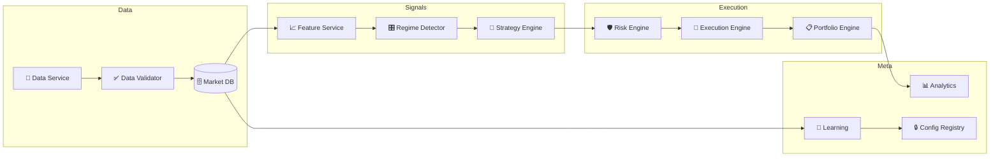

# 🤖 Crypto Bot v4.4

**Мульти-биржевая алгоритмическая торговая система.** Устойчивый, адаптивный, production-ready бот для фьючерсной торговли. Построен на 13 независимых сервисах с разделением онлайн-торговли и офлайн-обучения. Работает на Binance, Bybit, OKX и 100+ других биржах через единый CCXT-адаптер.



---

## 🎯 Почему v4.4

| Что было | Что стало |
|----------|-----------|
| Одна биржа (python-binance) | **100+ бирж** через единый CCXT-адаптер |
| Монолит | 13 независимых сервисов |
| Параметры менялись на лету | Неизменяемая конфигурация с версионированием |
| Стратегия одна | 3 стратегии × 5 рыночных режимов = 15 комбинаций |
| Риск вручную | Адаптивные стопы, Recovery Mode, дневные/недельные/месячные лимиты |
| Без мониторинга | Health Monitor с авто-остановкой при критических сбоях |
| Без обучения | Walk Forward + Bayesian Update + EWMA |

---

## 📦 Быстрый старт (30 секунд)

```bash
# 1. Клонировать
cd crypto_bot_v4

# 2. Установить
pip install -r requirements.txt

# 3. Настроить
cp .env.example .env
#   → в .env вставьте ключи Binance (тестнет или реальные)

# 4. Запустить
python main.py
```

Бот запустится в тестнете Binance, прогреет историю за 6 мес–5 лет, и начнёт 15-секундный цикл:
```
получение данных → валидация → признаки → режим → сигнал → риск → исполнение
```

---

## 🔌 CCXT — любая биржа, единый API

Главное преимущество v4.4 — слой абстракции биржи на базе [CCXT](https://github.com/ccxt/ccxt). Меняете биржу одной строкой, не трогая стратегии, риск-менеджмент и мониторинг.

```python
from core.exchange.adapter import create_exchange

# Binance Testnet (по умолчанию)
ex = create_exchange("binance", api_key="...", api_secret="...", testnet=True)

# Bybit — та же стратегия, те же сигналы, другой коннектор
ex = create_exchange("bybit", api_key="...", api_secret="...", testnet=True)

# OKX
ex = create_exchange("okx", api_key="...", api_secret="...")
```

```bash
# Переключение биржи в проде — env переменная
EXCHANGE_ID=bybit python main.py
EXCHANGE_ID=okx   python main.py
```

### Что даёт CCXT-адаптер

| Возможность | Реализация |
|-------------|------------|
| **100+ бирж** | Binance, Bybit, OKX, Kraken Futures, Bitget, HTX, … |
| **Единый API** | `fetch_ohlcv`, `create_limit_order`, `fetch_balance`, `fetch_positions` |
| **Авто-нормализация** | `BTCUSDT` ↔ `BTC/USDT`, таймфреймы `1h` ↔ `1h` |
| **Circuit Breaker** | 5 ошибок подряд → размыкание на 60 сек |
| **Rate Limiter** | Token bucket, не превышает лимиты биржи |
| **Retry с backoff** | 3 попытки с экспоненциальной задержкой |

### Поддерживаемые биржи

| Биржа | CCXT ID | Тип контрактов | Тестнет |
|-------|---------|---------------|---------|
| **Binance Futures** | `binance` | USDT-M | ✅ |
| **Bybit** | `bybit` | USDT Perpetual | ✅ |
| **OKX** | `okx` | USDT Swap | ✅ |
| **Kraken Futures** | `krakenfutures` | Фьючерсы | — |
| … | 100+ | | |

---

## 🏗️ Архитектура: 13 сервисов

Система построена как набор независимых сервисов с чёткими контрактами. Каждый можно тестировать, заменять и масштабировать отдельно.

```
┌──────────────────────────────────────────────────────────────────────┐
│                         15-секундный цикл                            │
│                                                                      │
│  Binance/Bybit/OKX                                                  │
│       │                                                              │
│  ┌────▼────────┐    ┌──────────────┐    ┌────────────────┐          │
│  │ ① Data      │───▶│ ② Validator  │───▶│  Market DB     │          │
│  │   Service   │    │   (6 checks) │    │  SQLite/PG     │          │
│  └─────────────┘    └──────────────┘    └───────┬────────┘          │
│                                                  │                   │
│  ┌─────────────┐    ┌──────────────┐    ┌───────▼────────┐          │
│  │ ③ Feature   │◀───│  DB → cache  │    │  OHLCV data    │          │
│  │   Service   │    │              │    │                │          │
│  └──────┬──────┘    └──────────────┘    └────────────────┘          │
│         │  ADX, ATR%, BB, CVD, уровни                               │
│  ┌──────▼──────┐                                                     │
│  │ ④ Regime    │  Trend/Range × High/Low Vol + Breakout             │
│  │   Detector  │  5 режимов → матрица весов стратегий               │
│  └──────┬──────┘                                                     │
│         │  regime + weights                                         │
│  ┌──────▼──────┐                                                     │
│  │ ⑤ Strategy  │  Sweep / Bounce / Breakout                         │
│  │   Engine    │  + confidence calibration                          │
│  └──────┬──────┘                                                     │
│         │  Signal(pair, direction, entry, SL, TP1, TP2, conf)       │
│  ┌──────▼──────┐                                                     │
│  │ ⑥ Risk      │  Позиционирование + лимиты + Recovery Mode         │
│  │   Engine    │                                                     │
│  └──────┬──────┘                                                     │
│         │  RiskDecision(approved, size, SL, RR)                     │
│  ┌──────▼──────┐    ┌──────────────┐                                │
│  │ ⑦ Execution │───▶│   Биржа      │   Limit / Market / Stop        │
│  │   Engine    │    │   (CCXT)     │   + Circuit Breaker            │
│  └──────┬──────┘    └──────────────┘                                │
│         │                                                           │
│  ┌──────▼──────┐                                                     │
│  │ ⑧ Portfolio │  Позиции, PnL, Event Sourcing                     │
│  │   Engine    │                                                     │
│  └─────────────┘                                                     │
│                                                                      │
│  ┌─────────────┐  ┌──────────────┐  ┌────────────┐  ┌────────────┐  │
│  │ ⑨ Analytics │  │ ⑩ Learning   │  │ ⑪ Config   │  │ ⑫ Health   │  │
│  │   Service   │  │   Service    │  │  Registry  │  │  Monitor   │  │
│  │ Sharpe, PF  │  │ Walk Forward │  │ Версионир. │  │ 8 метрик   │  │
│  └─────────────┘  └──────────────┘  └────────────┘  └────────────┘  │
└──────────────────────────────────────────────────────────────────────┘
```

### Каждый сервис — что делает и зачем

| # | Сервис | Функция | Ключевая особенность |
|---|--------|---------|---------------------|
| ① | **Data Service** | Получение OHLCV, OI, funding rate | Работает через CCXT — любая биржа |
| ② | **Data Validator** | 6 проверок качества | Критические ошибки → остановка торговли |
| ③ | **Feature Service** | ADX, ATR%, BB, CVD, liquidity levels | `< 100 мс` на 4 пары (NumPy) |
| ④ | **Regime Detector** | 5 рыночных режимов | Sigmoid/Gaussian веса + ML-интерфейс |
| ⑤ | **Strategy Engine** | Sweep, Bounce, Breakout | Калиброванный confidence |
| ⑥ | **Risk Engine** | Позиционирование, лимиты | Recovery Mode + дневные/недельные/месячные лимиты |
| ⑦ | **Execution Engine** | Ордера через CCXT | Circuit Breaker + retry с backoff |
| ⑧ | **Portfolio Engine** | Позиции, PnL, стопы | Event Sourcing — полная реконструкция |
| ⑨ | **Analytics Service** | Winrate, Sharpe, Calmar, PF | Real-time + hourly + daily + weekly |
| ⑩ | **Learning Service** | Walk Forward + Bayesian | Online: только статистика; Offline: выпуск конфига |
| ⑪ | **Config Registry** | Версионирование конфигураций | Неизменяемые во время торговли |
| ⑫ | **Health Monitor** | 8 инженерных метрик | ✅ Норма → ⚠️ Лог → ❌ Остановка |

---

## 📊 Торговые стратегии

### ① Liquidity Sweep

Ловит момент, когда цена пробивает уровень ликвидности и возвращается обратно — классический «снятие стопов».

```
Цена ▼              фитиль ▼        возврат ▲
────── уровень ────────────────────────────────
      └─ пробой ─┘               └─ вход LONG ▲

Wick ratio: 1.8–2.5    Volume ×1.25    Min RR: 2.0
```

### ② Liquidity Bounce

Цена касается уровня без пробоя и отскакивает — торговля от границ диапазона.

```
                         отскок ▲
────── уровень ─────────────────────────────────
      └─ касание ─┘           └─ вход LONG ▲

Wick ratio: 1.5–2.0    Volume ×1.10    Min RR: 1.5
```

### ③ Volatility Breakout

Выход из сжатия (Bollinger внутри Keltner) с объёмным подтверждением — ловля импульса.

```
   BB ▼                              ▲ breakout
 ════ цена ════  …сжатие…  ────────► вход ▲
   BB ▲

Squeeze active + Volume ×1.25    SL: ×1.5 ATR    TP: 2–4%
```

### Калибровка Confidence

```
CONFIDENCE = trend_match×0.25 + volume_spike×0.20 +
             structure_quality×0.15 + liquidity_depth×0.20 +
             session_score×0.20
```

Цель: `confidence=80%` → реальный winrate ≈ `80%`. Байесовское обновление корректирует калибровку онлайн.

---

## 🎛️ Рыночные режимы

Детектор определяет 5 режимов и назначает веса стратегиям — в тренде больше Sweep, в диапазоне больше Bounce.

| Режим | ADX | ATR% | Bounce | Sweep | Breakout |
|-------|-----|------|--------|-------|----------|
| 🔴 Trend High Vol | > 25 | > 80 | 0.2 | **0.6** | 0.2 |
| 🟠 Trend Low Vol | > 25 | < 20 | 0.3 | **0.5** | 0.2 |
| 🟡 Range High Vol | < 25 | > 80 | **0.5** | 0.3 | 0.2 |
| 🟢 Range Low Vol | < 25 | < 20 | **0.6** | 0.3 | 0.1 |
| 🔵 Breakout | — | — | 0.1 | 0.2 | **0.7** |

**Плавные веса** — Sigmoid + Gaussian сглаживают переходы между режимами:

```python
bounce_weight   = sigmoid((20 − adx) / 5)
sweep_weight    = gaussian(adx, μ=30, σ=10)
breakout_weight = sigmoid((adx − 40) / 5)

# Итог: blend = 0.5 × матрица + 0.5 × плавные веса
```

**ML-интерфейс** — в будущем можно заменить правила на обученную модель без переписывания кода:

```python
class RegimeDetector:
    def predict(self, features: dict) -> str
```

---

## 🛡️ Управление рисками

### Позиционирование

| Параметр | Значение |
|----------|----------|
| Риск на сделку | 1.5% (2.0% для депозита < $1,000) |
| Макс. позиций | 3 |
| Макс. корреляция | 0.7 |
| Общий риск | 3.0% |
| Направленная экспозиция | ±3.0 |

### Адаптивный стоп-лосс

| Режим волатильности | Множитель стопа |
|---------------------|-----------------|
| `ultra_quiet` | ×0.8 |
| `quiet` | ×1.0 |
| `normal` | ×1.2 |
| `volatile` | ×1.5 |

### Адаптивный Risk/Reward

| Расстояние до уровня | RR |
|---------------------|-----|
| < 0.3% | 1.5 – 2.0 |
| 0.3 – 0.8% | 2.0 – 3.0 |
| > 0.8% | 3.0 – 5.0 |

### Recovery Mode

```
Просадка > 8%
    │
    ▼
┌──────────────────┐
│ RECOVERY MODE    │
│ • Риск ÷ 2       │
│ • Обучение стоп   │
│ • Считаем wins   │
└──────┬───────────┘
       │ Просадка < 5%
       │ + 3 прибыльные сделки подряд
       ▼
   Выход из Recovery ✅
```

### Drawdown-лимиты

| Горизонт | Лимит |
|----------|-------|
| День | 2.0% |
| Неделя | 5.0% |
| Месяц | 10.0% |
| Общий | 15.0% |

При достижении любого лимита — новые сделки блокируются до сброса периода.

---

## 🧠 Обучение и оптимизация

### Разделение Online / Offline

| Режим | Что делает | Что НЕ делает |
|-------|-----------|---------------|
| **Online** (торговля) | Сбор статистики, Bayesian update, EWMA | ❌ Не меняет параметры |
| **Offline** (периодически) | Walk Forward, выпуск кандидата, canary test | — |

### Walk Forward

```
│── Train (6 мес) ──│ Test (1 мес) │
                      │── Train (6 мес) ──│ Test (1 мес) │
                                           │── Train (6 мес) ──│ …
```

Параметры: окно обучения 6 мес, тест 1 мес, шаг 1 мес. Минимум 3 стабильных окна подряд.

### Multi-Criteria Score

```
score = 0.35×sharpe_norm + 0.25×pf_norm
      + 0.20×dd_norm    + 0.20×stability_norm
```

### Bayesian Update (онлайн)

```python
class StrategyBayesian:
    α = 1.0, β = 1.0          # prior: 50% winrate
    
    def update(win: bool):    # posterior
        win → α += 1
        loss → β += 1
    
    def expected_winrate():   # α / (α + β)
    def credible_interval():  # 95% CI
```

### EWMA ожидаемой доходности

```python
EWMA_return = λ×rr + (1−λ)×EWMA_return,  λ = 0.05
```

Медленно адаптируется к изменениям доходности стратегии — раннее обнаружение деградации.

---

## 💚 Мониторинг

Health Monitor проверяет 8 метрик на каждом 15-секундном цикле:

| Метрика | Порог | При нарушении |
|---------|-------|---------------|
| Задержка данных | < 500 мс | ⚠️ |
| Расчёт признаков | < 100 мс | ⚠️ |
| CPU | < 80% | ⚠️ |
| Память | < 2 ГБ | ⚠️ |
| Ошибки API | < 5/мин | ⚠️ |
| Повторные запросы | < 10% | ⚠️ |
| Выставление ордера | < 1 сек | ⚠️ |
| WebSocket | ✅ подключён | ❌ |

**Три уровня реакции:**
- ✅ **HEALTHY** — нормальная работа
- ⚠️ **WARNING** — логирование, алерт
- ❌ **CRITICAL** — остановка торговли

---

## 📁 Структура проекта

```
crypto_bot_v4/
│
├── main.py                            # 🎯 Оркестратор: полный 15-сек цикл
├── requirements.txt                   # Зависимости
├── pyproject.toml                     # pytest + asyncio конфиг
├── .env.example                       # Пример переменных окружения
│
├── config/
│   ├── config_v4.4.1.yaml             # ⚙️ Полная конфигурация (YAML)
│   └── registry.py                    # 🔒 Config Registry (версии + хеши)
│
├── core/
│   ├── models/__init__.py             # 📐 20+ дата-классов (Signal, OHLCV, …)
│   ├── database/db_manager.py         # 🗄️ SQLAlchemy: 6 таблиц
│   ├── events/event_store.py          # 📜 Event Sourcing (Portfolio)
│   └── exchange/                      # 🔌 CCXT-адаптер
│       └── adapter.py                 # Unified API: Binance/Bybit/OKX/…
│
├── services/
│   ├── data_service/service.py        # 📡 OHLCV + OI + funding (CCXT)
│   ├── data_validator/validator.py    # ✅ 6 проверок качества
│   ├── feature_service/calculator.py  # 📈 ADX, ATR%, BB, CVD, уровни
│   ├── regime_detector/detector.py    # 🎛️ 5 режимов + ML-интерфейс
│   ├── strategy_engine/engine.py      # 🎯 Sweep / Bounce / Breakout
│   ├── risk_engine/engine.py          # 🛡️ Риск + Recovery Mode
│   ├── execution_engine/engine.py     # 💱 Ордера (CCXT) + Circuit Breaker
│   ├── portfolio_engine/engine.py     # 📋 Позиции + Event Sourcing
│   ├── analytics_service/service.py   # 📊 Sharpe, Calmar, PF, MAE/MFE
│   ├── learning_service/service.py    # 🧠 Walk Forward + Bayesian + EWMA
│   └── health_monitor/monitor.py      # 💚 8 инженерных метрик
│
├── tests/
│   ├── unit/test_services.py          # 🧪 29 тестов: все сервисы
│   └── unit/test_exchange.py          # 🔌 16 тестов: CCXT адаптер
│
├── docker/
│   ├── Dockerfile                     # 🐳 Docker образ
│   ├── docker-compose.yml             # Bot + PG + Redis + Prometheus + Grafana
│   └── prometheus.yml                 # Prometheus конфиг
│
└── docs/
    ├── ARCHITECTURE.md                # Архитектура и взаимодействие
    ├── API.md                         # FastAPI мониторинг
    ├── CONFIG.md                      # Все параметры конфигурации
    ├── DEPLOYMENT.md                  # Развёртывание
    ├── BACKTEST.md                    # Методология Walk Forward
    ├── EXPERIMENTS.md                 # Журнал экспериментов
    └── TROUBLESHOOTING.md             # Решение проблем
```

---

## 🚀 Развёртывание

### Development

```bash
pip install -r requirements.txt
python main.py
```

### Docker (Production)

```bash
docker-compose -f docker/docker-compose.yml up -d
```

Стек из 5 контейнеров:

```
┌──────────────┐  ┌──────────────┐  ┌──────────────┐
│  Crypto Bot  │  │  PostgreSQL  │  │    Redis     │
│  Python 3.11 │  │     15       │  │     7        │
└──────┬───────┘  └──────────────┘  └──────────────┘
       │
┌──────▼───────┐  ┌──────────────┐
│  Prometheus  │  │   Grafana    │
│  :9090       │  │   :3000      │
└──────────────┘  └──────────────┘
```

После запуска:
- 📊 **Grafana**: <http://localhost:3000> (`admin` / `admin`)
- 📈 **Prometheus**: <http://localhost:9090>
- 💚 **Health Check**: <http://localhost:8000/health>
- 📋 **Portfolio**: <http://localhost:8000/portfolio>

### Ежемесячный бюджет

| Сервис | USD/мес |
|--------|---------|
| VPS (4 vCPU, 8 GB, 100 GB SSD) | $40–60 |
| PostgreSQL (managed) | $15–30 |
| Redis (managed) | $10–15 |
| Мониторинг | $5–10 |
| **Итого** | **$70–115** |

---

## 🧪 Тестирование

### 45 тестов, все проходят

```bash
# Все тесты
python -m pytest tests/ -v

# С coverage
python -m pytest tests/ -v --cov=services --cov=core --cov-report=term-missing

# Конкретный файл
python -m pytest tests/unit/test_exchange.py -v
python -m pytest tests/unit/test_services.py -v
```

| Группа | Тестов | Что покрыто |
|--------|--------|-------------|
| **Exchange Adapter** | 16 | Circuit Breaker, символы, фабрика, Rate Limiter |
| **Data Validator** | 4 | Пропуски, негативные цены, дубликаты, гэпы |
| **Feature Calculator** | 3 | ADX, ATR, BB, wick ratio, liquidity levels |
| **Regime Detector** | 7 | 5 режимов, sigmoid/gaussian, predict(), веса |
| **Strategy Engine** | 3 | Confidence, структура сигнала, пустой рынок |
| **Risk Engine** | 4 | Одобрение, лимиты, Recovery Mode, просадка |
| **Learning** | 5 | Bayesian, EWMA, Walk Forward scoring |
| **Analytics** | 2 | Пустые метрики, базовый расчёт |
| **Итого** | **45** | ✅ |

---

## ⚙️ Конфигурация

Система использует YAML-конфиг с версионированием (`config/config_v4.4.1.yaml`). Каждая конфигурация получает SHA-256 хеш и уникальную версию. Параметры **никогда не меняются во время торговли**.

### Ключевые параметры

<details>
<summary><b>📡 Data & Exchange</b></summary>

```yaml
data:
  pairs: [BTCUSDT, ETHUSDT, SOLUSDT, BNBUSDT]
  timeframes: [15m, 1h, 4h, 1d]
  lookback_days: 90

# Биржа задаётся через env EXCHANGE_ID (binance / bybit / okx / …)
```
</details>

<details>
<summary><b>🎯 Strategies</b></summary>

```yaml
strategy:
  sweep:
    wick_ratio: 1.8          # мин. отношение фитиля к телу
    volume_multiplier: 1.25  # объём × средний для подтверждения
    tolerance: 0.0018        # близость к уровню (0.18%)
    min_rr: 2.0              # мин. Risk/Reward

  bounce:
    wick_ratio: 1.5
    volume_multiplier: 1.10
    tolerance: 0.0018
    min_rr: 1.5

  breakout:
    sl_atr_mult: 1.5         # стоп: ×1.5 ATR
    tp_min: 0.02             # тейк-профит мин 2%
    tp_max: 0.04             # тейк-профит макс 4%
```
</details>

<details>
<summary><b>🛡️ Risk</b></summary>

```yaml
risk:
  max_risk_per_trade: 0.015
  max_positions: 3
  max_correlation: 0.7
  max_exposure: 3.0
  stop_multiplier:
    ultra_quiet: 0.8
    quiet: 1.0
    normal: 1.2
    volatile: 1.5
  drawdown_limits:
    daily: 2.0
    weekly: 5.0
    monthly: 10.0
    max_total: 15.0
  recovery:
    threshold: 8.0           # вход в Recovery
    exit_threshold: 5.0      # выход из Recovery
    min_wins: 3              # подряд побед для выхода
```
</details>

<details>
<summary><b>🧠 Learning</b></summary>

```yaml
learning:
  min_trades: 100
  min_windows: 3             # мин. стабильных окон Walk Forward
  train_period: 6            # месяцев
  test_period: 1             # месяц
  step: 1                    # шаг
  score_weights:
    sharpe: 0.35
    profit_factor: 0.25
    drawdown: 0.20
    stability: 0.20
```
</details>

---

## 🛠️ Стек

| Слой | Технология |
|------|-----------|
| Язык | Python 3.10+ |
| Биржевой API | **CCXT 4.4+** (Binance / Bybit / OKX / Kraken / …) |
| База данных | SQLite (dev) → PostgreSQL 15 (prod) |
| Кэш | Redis 7 |
| Контейнеризация | Docker + Docker Compose |
| Мониторинг | Prometheus + Grafana |
| Health API | FastAPI + Uvicorn |
| Логирование | structlog (структурированное) |
| Данные | Parquet (история) |
| Тесты | pytest + pytest-asyncio |

---

## 📚 Документация

| Документ | Содержание |
|----------|------------|
| [ARCHITECTURE.md](docs/ARCHITECTURE.md) | Архитектура, схема взаимодействия, Online/Offline |
| [API.md](docs/API.md) | FastAPI эндпоинты мониторинга |
| [CONFIG.md](docs/CONFIG.md) | Полный справочник всех параметров |
| [DEPLOYMENT.md](docs/DEPLOYMENT.md) | Развёртывание, Docker, переменные окружения |
| [BACKTEST.md](docs/BACKTEST.md) | Walk Forward методология, multi-criteria scoring |
| [EXPERIMENTS.md](docs/EXPERIMENTS.md) | Журнал экспериментов, версионирование результатов |
| [TROUBLESHOOTING.md](docs/TROUBLESHOOTING.md) | Типовые проблемы и решения |

---

## ✅ Критерии готовности

| Критерий | Статус |
|----------|--------|
| 13 сервисов реализованы | ✅ |
| CCXT-адаптер (100+ бирж) | ✅ |
| Online/Offline разделены | ✅ |
| Walk Forward + Multi-Criteria Score | ✅ |
| Bayesian + EWMA онлайн-статистика | ✅ |
| Recovery Mode + Circuit Breaker | ✅ |
| Data Validator (6 проверок) | ✅ |
| Health Monitor (8 метрик) | ✅ |
| Event Sourcing (Portfolio) | ✅ |
| Config Registry с версионированием | ✅ |
| Docker Compose (5 контейнеров) | ✅ |
| 45 тестов проходят | ✅ |
| 7 документов документации | ✅ |
| Прибыльность: PF > 1.3 | 🔜 Forward-test |
| Стабильность на 2+ режимах | 🔜 Forward-test |

---

<p align="center">
  <b>Crypto Bot v4.4</b><br>
  Версия 4.4.1 · 13.07.2026 · 45 тестов · 100+ бирж<br>
  <sub>Построено на CCXT · Python · Docker · Prometheus/Grafana</sub>
</p>
