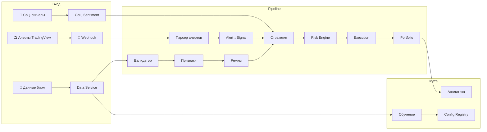

# 🤖 Crypto Bot v4.4

**Мульти-биржевая алгоритмическая торговая платформа** — 13+1 сервисов, 100+ бирж через CCXT, интеграция с TradingView (алерт → реальный ордер), социальные сигналы, офлайн Walk Forward обучение.



---

## 🚀 Быстрый старт

```bash
git clone <repo> && cd crypto_bot_v4
pip install -r requirements.txt
cp .env.example .env   # вставьте API-ключи Binance
python main.py
```

Бот прогреет историю (6 мес – 5 лет), затем начнёт 15-секундный торговый цикл. Health API, TradingView webhook и Prometheus-метрики — на порту `:8000`.

---

## 📦 Что внутри

### 📺 TradingView → реальные ордера

Отправьте алерт из TradingView через webhook — бот превратит его в позицию с корректным риск-сайзингом, стоп-лоссом и тейк-профитом, пропустив через полный Risk → Execution pipeline.

```bash
# Алерт → BUY BTCUSDT со стопом и тейком
curl -X POST :8000/webhook/tradingview \
  -d '{"action":"BUY","symbol":"BTCUSDT","price":65000,"stop_loss":64500,"take_profit":66000}'
```

**Поддерживаемые форматы:** JSON, OctoBot (`SIGNAL=BUY SYMBOL=BTCUSDT`), обычный текст, PineConnector. Автоопределение формата.

**5 адаптеров индикаторов** — RSI, MACD, Bollinger Bands, EMA/SMA кроссовер, Stochastic — каждый даёт адаптивные SL/TP и PineScript-шаблоны, которые можно сразу вставить в TradingView:

```bash
curl :8000/webhook/indicators/rsi     # PineScript-шаблон для RSI-алертов
curl :8000/webhook/indicators          # все поддерживаемые индикаторы
```

### 💬 Социальные и сентимент-сигналы

Индекс страха и жадности, социальный объём, активность китов, настроения инфлюенсеров и композитный score — усиливают или ослабляют confidence алерта перед исполнением.

```bash
curl :8000/webhook/social?pair=BTCUSDT     # полный сентимент-профиль
curl :8000/webhook/social/fear-greed       # только Fear & Greed
```

Сентимент встроен в `AlertToSignalConverter`: экстремальный страх → выше confidence на BUY; экстремальная жадность → tighter стопы; киты распределяют → меньше размер позиции.

---

## 🏗️ Архитектура

### Карта сервисов

```
                   ┌─────────────────────────────────────────┐
                   │           СЛОЙ ВХОДНЫХ ДАННЫХ           │
                   │  Binance/Bybit/OKX (CCXT)              │
                   │  TradingView Webhooks + Social API     │
                   └───────────────┬─────────────────────────┘
                                   │
   ┌───────────────────────────────┼───────────────────────────────┐
   │                               │                               │
   ▼                               ▼                               ▼
┌──────────┐              ┌──────────────┐              ┌─────────────────┐
│ ① Data   │──────────────▶│ ② Validator  │──────────────▶│  Market DB      │
│ Service  │              │  (6 проверок)│              │  SQLite / PG    │
└──────────┘              └──────┬───────┘              └────────┬────────┘
                                 │                                │
   ┌─────────────────────────────┘                                │
   │                                                              │
   ▼                                                              │
┌──────────┐              ┌──────────────┐                        │
│ ③ Feature│──────────────▶│ ④ Regime     │                       │
│ Service  │              │  Detector    │                       │
│ ADX ATR% │              │  5 режимов   │                       │
│ BB CVD   │              │  + ML-интерф.│                       │
└──────────┘              └──────┬───────┘                       │
                                 │                                │
   ┌─────────────────────────────┘                                │
   │                                                              │
   ▼                                                              │
┌──────────┐   ┌──────────────────┐   ┌──────────────────┐       │
│ ⑤ Страт. │◀──│ Алерты TradingView│◀──│ Соц. сигналы     │       │
│ Engine   │   │ (webhook → Signal)│   │ (Fear/Greed...)  │       │
│ Sweep    │   └──────────────────┘   └──────────────────┘       │
│ Bounce   │                                                      │
│ Breakout │                                                      │
└────┬─────┘                                                      │
     │                                                            │
     ▼                                                            │
┌──────────┐   ┌──────────────┐   ┌──────────────┐               │
│ ⑥ Risk   │──▶│ ⑦ Execution  │──▶│    Биржа      │               │
│ Engine   │   │   Engine     │   │    (CCXT)    │               │
│ Recovery │   │   CircuitBr  │   └──────────────┘               │
│ Лимиты   │   │   Retry      │                                   │
└────┬─────┘   └──────────────┘                                   │
     │                                                            │
     ▼                                                            │
┌──────────┐                                                      │
│ ⑧ Portf. │  Позиции, PnL, Event Sourcing                       │
│ Engine   │◀─────────────────────────────────────────────────────┘
└────┬─────┘
     │
     ▼
┌──────────┐  ┌──────────────┐  ┌──────────────┐  ┌──────────────┐
│ ⑨ Аналит.│  │ ⑩ Обучение   │  │ ⑪ Config     │  │ ⑫ Health     │
│ Service  │  │   Service    │  │   Registry   │  │   Monitor    │
│ Sharpe   │  │ Walk Forward │  │  Версион.    │  │   8 метрик   │
│ Calmar   │  │ Bayesian     │  │  Неизмен.    │  │   авто-стоп  │
│ PF MAE   │  │ EWMA Score   │  │  Хеширован.  │  │              │
└──────────┘  └──────────────┘  └──────────────┘  └──────────────┘

                           ┌──────────────────┐
                           │ ⑬ TradingView    │
                           │   Service        │
                           │ Alert → Signal   │
                           │ Индикаторы       │
                           │ Соц./Sentiment   │
                           └──────────────────┘
```

### Online vs Offline

| Режим | Действия | Запрещено |
|-------|----------|-----------|
| **Online** | Сбор статистики, Bayesian update, EWMA, исполнение | ❌ Менять параметры |
| **Offline** | Walk Forward, multi-criteria score, выпуск конфига-кандидата | — |

---

## 📊 Торговые стратегии

### ① Liquidity Sweep
Цена пробивает уровень ликвидности, делает фитиль, возвращается — классический снятие стопов.
```
Wick ratio 1.8–2.5 · Объём ×1.25 · Мин RR 2.0
```

### ② Liquidity Bounce
Цена касается уровня без пробоя и отскакивает — торговля от границ диапазона.
```
Wick ratio 1.5–2.0 · Объём ×1.10 · Мин RR 1.5
```

### ③ Volatility Breakout
Сжатие (BB внутри Keltner) разрешается с объёмным импульсом — вход по моментуму.
```
Squeeze активен + Объём ×1.25 · SL ×1.5 ATR · TP 2–4%
```

### Калибровка Confidence
```
CONFIDENCE = trend_match×0.25 + volume_spike×0.20
           + structure_quality×0.15 + liquidity_depth×0.20
           + session_score×0.20
```
Цель: `confidence=80%` → реальный winrate ≈ `80%`.

---

## 🎛️ Рыночные режимы

| Режим | ADX | ATR% | Bounce | Sweep | Breakout |
|-------|-----|------|--------|-------|----------|
| 🔴 Trend High Vol | > 25 | > 80 | 0.2 | **0.6** | 0.2 |
| 🟠 Trend Low Vol | > 25 | < 20 | 0.3 | **0.5** | 0.2 |
| 🟡 Range High Vol | < 25 | > 80 | **0.5** | 0.3 | 0.2 |
| 🟢 Range Low Vol | < 25 | < 20 | **0.6** | 0.3 | 0.1 |
| 🔵 Breakout | — | — | 0.1 | 0.2 | **0.7** |

**Плавное смешивание:** `итоговый_вес = 0.5 × матрица + 0.5 × sigmoid_gaussian`
```
bounce_weight   = sigmoid((20 − adx) / 5)
sweep_weight    = gaussian(adx, μ=30, σ=10)
breakout_weight = sigmoid((adx − 40) / 5)
```
ML-интерфейс: `RegimeDetector.predict(features: dict) → str` — замените на обученную модель позже.

---

## 🛡️ Управление рисками

| Слой | Механизм |
|------|----------|
| **Позиция** | 1.5% риска/сделку · адаптивный SL (×0.8 … ×1.5) · адаптивный RR (1.5–5.0) |
| **Лимиты** | Макс 3 позиции · корреляция ≤ 0.7 · экспозиция ±3.0% |
| **Recovery** | Просадка > 8% → риск ÷ 2, обучение заморожено → выход при < 5% + 3 вин-стрика |
| **Просадки** | День 2% · Неделя 5% · Месяц 10% · Общая 15% |

---

## 🧠 Обучение

**Walk Forward:** Train 6 мес → Test 1 мес → Step 1 мес. Мин 3 стабильных окна.

**Multi-Criteria Score:** `0.35×sharpe + 0.25×pf + 0.20×dd + 0.20×stability`

**Bayesian (онлайн):** Beta(α, β) обновляется после каждой сделки → ожидаемый winrate + 95% credible interval

**EWMA (онлайн):** `EWMA_return = 0.05×rr + 0.95×EWMA_return` → раннее обнаружение деградации

---

## 📁 Структура проекта

```
crypto_bot_v4/
├── main.py                               # 🎯 Оркестратор: главный 15-сек цикл
├── requirements.txt / pyproject.toml     # Зависимости + pytest конфиг
├── .env.example                          # Шаблон переменных окружения
├── LICENSE                               # MIT
│
├── config/
│   ├── config_v4.4.1.yaml                # ⚙️ Полная конфигурация (YAML)
│   └── registry.py                       # 🔒 Версионированное, неизменяемое хранилище
│
├── core/
│   ├── models/__init__.py                # 📐 20+ дата-классов
│   ├── database/db_manager.py            # 🗄️ SQLAlchemy ORM (7 таблиц, bulk upsert)
│   ├── events/event_store.py             # 📜 Event Sourcing для Portfolio
│   └── exchange/adapter.py               # 🔌 CCXT: единый интерфейс для 100+ бирж
│
├── services/
│   ├── data_service/service.py           # 📡 OHLCV + OI + funding (CCXT, паралл. прогрев)
│   ├── data_validator/validator.py       # ✅ 6 проверок качества данных
│   ├── feature_service/calculator.py     # 📈 ADX, ATR%, BB, CVD, уровни (векторизовано)
│   ├── regime_detector/detector.py       # 🎛️ 5 режимов + sigmoid/gaussian + ML-интерфейс
│   ├── strategy_engine/engine.py         # 🎯 Sweep / Bounce / Breakout
│   ├── risk_engine/engine.py             # 🛡️ Позиционирование + Recovery Mode
│   ├── execution_engine/engine.py        # 💱 Ордера + Circuit Breaker + retry
│   ├── portfolio_engine/engine.py        # 📋 Позиции + Event Sourcing
│   ├── analytics_service/service.py      # 📊 Sharpe, Calmar, PF, MAE/MFE
│   ├── learning_service/service.py       # 🧠 Walk Forward + Bayesian + EWMA
│   ├── health_monitor/monitor.py         # 💚 8 инженерных метрик
│   └── tradingview_service/              # 📺 Интеграция с TradingView
│       ├── __init__.py                   #   Парсер алертов, Конвертер, Безопасность, Менеджер
│       ├── indicators/registry.py        #   RSI, MACD, BB, EMA/SMA, Stoch, VolProf
│       └── social/registry.py            #   Fear & Greed, сентимент, активность китов
│
├── api/
│   ├── server.py                         # 🌐 FastAPI + Prometheus метрики
│   └── tradingview_routes.py             # 📺 Webhook эндпоинты + индикаторы + social API
│
├── tests/
│   ├── unit/test_services.py             # 🧪 45 тестов: основные сервисы
│   ├── unit/test_exchange.py             # 🔌 16 тестов: CCXT адаптер
│   └── unit/test_tradingview.py          # 📺 49 тестов: TradingView интеграция
│
├── docker/
│   ├── Dockerfile / docker-compose.yml   # 🐳 Стек из 5 контейнеров
│   └── prometheus.yml
│
└── docs/
    ├── ARCHITECTURE.md / API.md / CONFIG.md
    ├── DEPLOYMENT.md / BACKTEST.md
    ├── EXPERIMENTS.md / TROUBLESHOOTING.md
```

---

## 📺 Интеграция с TradingView

### Эндпоинты

| Метод | URL | Назначение |
|-------|-----|-----------|
| `POST` | `/webhook/tradingview` | Основной webhook — JSON, OctoBot, текст, PineConnector |
| `POST` | `/webhook/tradingview/v2` | Расширенный webhook с данными индикаторов |
| `GET` | `/webhook/indicators` | Список индикаторов + PineScript-шаблоны |
| `GET` | `/webhook/indicators/{name}` | PineScript-шаблон для конкретного индикатора |
| `GET` | `/webhook/social?pair=BTCUSDT` | Социальные/сентимент-сигналы по паре |
| `GET` | `/webhook/social/fear-greed` | Только индекс страха и жадности |
| `GET` | `/webhook/alerts/recent` | История последних алертов |

### Путь алерта: от TradingView до ордера

```
Алерт TradingView
    │
    ▼
AlertParser.detect_format()   ← автоопределение формата (JSON/OctoBot/текст/PineConnector)
    │
    ▼
WebhookSecurity.validate()    ← проверка токена / HMAC
    │
    ▼
AlertManager.should_process() ← дедупликация (окно 30 сек) + rate limit (20/мин)
    │
    ▼
IndicatorRegistry.recommend() ← адаптивные SL/TP из RSI/MACD/BB
SocialSignalRegistry.get()    ← буст/снижение confidence от сентимента
    │
    ▼
AlertToSignalConverter        ← ParsedAlert → нативный Signal бота
    │
    ▼
RiskEngine.evaluate_signal()  ← риск-сайзинг, лимиты, проверка Recovery
    │
    ▼
ExecutionEngine.place_entry() ← CCXT ордер → биржа
    │
    ▼
PortfolioEngine.open_position()
```

### PineScript-шаблоны (вставьте в TradingView)

```pinescript
// RSI алерт — вставьте в поле сообщения алерта TradingView:
rsiValue = ta.rsi(close, 14)
// Алерт: rsiValue < 30 (перепродан → BUY)
// Алерт: rsiValue > 70 (перекуплен → SELL)
// Webhook URL: https://your-server:8000/webhook/tradingview/v2
// Сообщение: {"action":"{{strategy.order.action}}","symbol":"BTCUSDT","indicator":"rsi","indicator_value":{{plot("RSI")}},"confidence":0.8}
```

---

## 💚 API эндпоинты

| Метод | URL | Назначение |
|-------|-----|-----------|
| `GET` | `/health` | Проверка здоровья |
| `GET` | `/health/status` | Детальные метрики + uptime 24ч |
| `GET` | `/portfolio` | Баланс, эквити, позиции, PnL |
| `GET` | `/analytics/metrics` | Winrate, Sharpe, Calmar, PF |
| `GET` | `/analytics/daily` | Дневной отчёт |
| `GET` | `/learning/status` | Bayesian winrates, EWMA return |
| `GET` | `/config/current` | Активная конфигурация |
| `GET` | `/config/versions` | История версий конфигураций |
| `GET` | `/execution/quality` | Проскальзывание, задержка, fill rate |
| `GET` | `/metrics` | Prometheus метрики |

---

## 🐳 Развёртывание

```bash
docker-compose -f docker/docker-compose.yml up -d
```

Стек: **Bot** + **PostgreSQL 15** + **Redis 7** + **Prometheus** + **Grafana**

| URL | Сервис |
|-----|--------|
| `:3000` | Grafana (admin/admin) |
| `:9090` | Prometheus |
| `:8000` | Bot API + TradingView webhook |
| `:8000/docs` | Swagger UI |

### Ежемесячный бюджет

| Сервис | USD/мес |
|--------|---------|
| VPS (4 vCPU, 8 GB, 100 GB SSD) | $40–60 |
| PostgreSQL (managed) | $15–30 |
| Redis (managed) | $10–15 |
| Мониторинг | $5–10 |
| **Итого** | **$70–115** |

---

## 🔌 CCXT: любая биржа, единый API

```python
from core.exchange.adapter import create_exchange

ex = create_exchange("binance", api_key="...", api_secret="...", testnet=True)
ex = create_exchange("bybit",   api_key="...", api_secret="...", testnet=True)
ex = create_exchange("okx",    api_key="...", api_secret="...")
```

Смена биржи одной переменной окружения:

```bash
EXCHANGE_ID=bybit python main.py
```

Встроено: Circuit Breaker, Rate Limiter, нормализация символов (`BTCUSDT` ↔ `BTC/USDT`), retry с экспоненциальной задержкой.

### Поддерживаемые биржи

| Биржа | CCXT ID | Тип контрактов | Тестнет |
|-------|---------|---------------|---------|
| **Binance Futures** | `binance` | USDT-M | ✅ |
| **Bybit** | `bybit` | USDT Perpetual | ✅ |
| **OKX** | `okx` | USDT Swap | ✅ |
| **Kraken Futures** | `krakenfutures` | Фьючерсы | — |
| … | 100+ | | |

---

## 🧪 Тестирование

```bash
python -m pytest tests/ -v                     # 94 теста
python -m pytest tests/ -v --cov=services --cov=core
```

| Группа | Тестов | Покрытие |
|--------|--------|----------|
| **TradingView** | 49 | Парсинг алертов (4 формата), адаптеры индикаторов, соц. сигналы, безопасность, дедупликация, конвертер |
| **Exchange** | 16 | Circuit Breaker, нормализация символов, фабрика, Rate Limiter |
| **Основные сервисы** | 29 | Валидатор, Признаки, Режимы, Стратегия, Риск, Bayesian, EWMA, Аналитика |

**94/94 проходят ✅ · 0 предупреждений**

---

## 🛠️ Стек технологий

| Слой | Технология |
|------|-----------|
| Язык | Python 3.10+ |
| Биржевой API | CCXT 4.4+ (Binance / Bybit / OKX / Kraken / 100+) |
| Webhook сервер | FastAPI + Uvicorn |
| База данных | SQLite (dev) → PostgreSQL 15 (prod) |
| Кэш | Redis 7 |
| Мониторинг | Prometheus + Grafana |
| Логирование | structlog |
| Данные | Parquet (история) |
| Тесты | pytest + pytest-asyncio |

---

## 📚 Документация

| Документ | Содержание |
|----------|-----------|
| [ARCHITECTURE.md](docs/ARCHITECTURE.md) | Взаимодействие сервисов, потоки данных, Online/Offline |
| [API.md](docs/API.md) | Все API эндпоинты |
| [CONFIG.md](docs/CONFIG.md) | Каждый параметр конфигурации |
| [DEPLOYMENT.md](docs/DEPLOYMENT.md) | Docker, переменные окружения, инфраструктура |
| [BACKTEST.md](docs/BACKTEST.md) | Методология Walk Forward |
| [EXPERIMENTS.md](docs/EXPERIMENTS.md) | Журнал экспериментов, версионирование |
| [TROUBLESHOOTING.md](docs/TROUBLESHOOTING.md) | Типовые проблемы и решения |

---

## ✅ Критерии готовности

| Критерий | Статус |
|----------|--------|
| 13 основных сервисов + TV интеграция | ✅ |
| CCXT адаптер (100+ бирж) | ✅ |
| TradingView webhook → реальные ордера | ✅ |
| 5 адаптеров индикаторов + PineScript-шаблоны | ✅ |
| Социальные/сентимент сигналы (Fear & Greed, киты, объём) | ✅ |
| FastAPI + Prometheus метрики | ✅ |
| Разделение Online/Offline | ✅ |
| Walk Forward + Bayesian + EWMA | ✅ |
| Recovery Mode + Circuit Breaker | ✅ |
| Data Validator (6 проверок) | ✅ |
| Health Monitor (8 метрик) | ✅ |
| Event Sourcing (Portfolio) | ✅ |
| Config Registry (версионирование, неизменяемость, хеши) | ✅ |
| Docker Compose (5 контейнеров) | ✅ |
| 94 теста, 0 предупреждений | ✅ |
| 7 документов документации | ✅ |
| Прибыльность: PF > 1.3 | 🔜 Forward-test |
| Стабильность на 2+ режимах | 🔜 Forward-test |

---

<p align="center">
  <b>Crypto Bot v4.4</b><br>
  Версия 4.4.1 · 13.07.2026 · 94 теста · 100+ бирж · TradingView ready<br>
  <sub>Построено на CCXT · Python · Docker · Prometheus/Grafana</sub>
</p>
